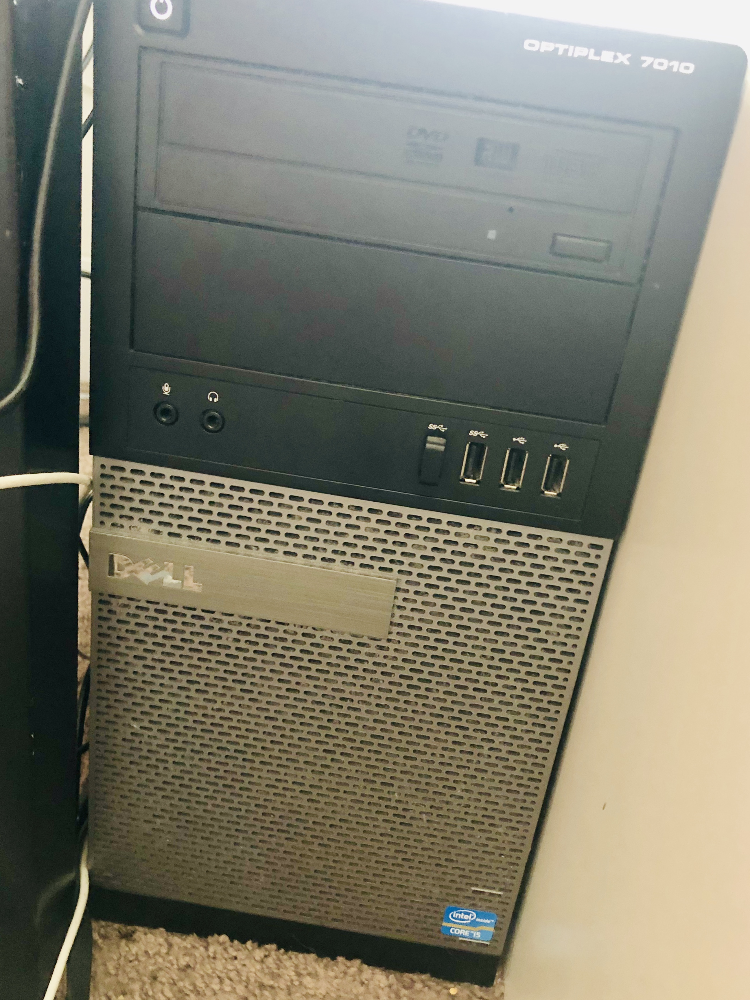

# 💻 Custom PC Specs

## Middle-School-Era PC

Lying around in my home at China is a PC that I held dear the most during my six years of middle-to-high school era. I barely touched it anymore after entering college. Therefore, the computer was only "powerful" as I remembered it, till mid 2019 when I got home \(after two years aboard doing my master's; that's six years away from this PC\) and discovered just how outdated my old friend is.

Without further emotional reviews, here's the specs:

* **CPU**: [~~Intel® Pentium® Processor E5700~~](https://ark.intel.com/content/www/us/en/ark/products/42801/intel-pentium-processor-e5700-2m-cache-3-00-ghz-800-mhz-fsb.html) ~~\(2M Cache, 3.00 GHz, 800 MHz FSB\)~~
  * ~~~~[~~Second-hand listings on Amazon~~](https://www.amazon.com/gp/offer-listing/B003WQ0L12/ref=dp_olp_0?ie=UTF8&condition=all) ~~suggest a wide range of price. I'd say mine is worth $20.~~
  * Taobao listing gives CNY￥11 \(~US$1.60\).
  * Update 08/28/19: Upgraded this to an [Intel® Core™2 Quad Processor Q9650](https://ark.intel.com/content/www/us/en/ark/products/35428/intel-core-2-quad-processor-q9650-12m-cache-3-00-ghz-1333-mhz-fsb.html) for CNY￥205 \(~US$28.63\).
    * This is the highest-performance CPU that is officially supported.
* **Power Supply Unit \(PSU\):** [AcBel PC7009](http://www.acbel.com/eng/Product.aspx?id=48&&sd=31&&pid=179). 430W. 
  * Used price: ~~About~~ [~~$67~~](https://www.pchub.com/acbel-polytech-pc7009-server-power-supply-430w-pc7009-atx12v-p157618)~~?~~ CNY￥35 \(~US$5.09\).
* **Motherboard**: Gigabyte [GA-EP45C-DS3](https://www.gigabyte.com/Motherboard/GA-EP45C-DS3-rev-10#ov) \(w/o R\) with BIOS version F5
  * **The on-board CMOS battery needs replacement.** With a power outage, the BIOS always falls back to a last-known-good configuration, which holds CPU running at 1.7GHz instead of 3.0GHz.
  * You can get an used one for CNY￥250 \(~US$36.32\).
* **RAM**: 2x2GB=4GB. 
  * Model: [Kingston 2GB 240-Pin DDR3 SDRAM DDR3 1333 Desktop Memory Model KVR1333D3S8N9/2G](https://www.newegg.com/kingston-2gb-240-pin-ddr3-sdram/p/N82E16820139640?Description=KVR1333D3S8N9%2f2G&cm_re=KVR1333D3S8N9%2f2G-_-20-139-640-_-Product). Remember that I have two pieces of this occupying the only two DDR3 slots.
    * Current worth per piece, per Newegg: New from $34.031; Used from $17.95.
    * Specs: [PDF](https://www.kingston.com/datasheets/kvr1333d3s8n9_2g.pdf)
  * A relevantly newer pair of RAM modules does not work with this particular motherboard \(or CPU\). Maybe I just need to tweak the BIOS settings?
    * While we are on it: list of [compatible RAMs](http://download.gigabyte.cn/FileList/Memory/motherboard_memory_ga-ep45c-ds3.pdf) \(PDF\).
* **GPU**: [Nvidia GeForce GTX 460](https://www.geforce.com/hardware/desktop-gpus/geforce-gtx-460). I just brighout this back from the USA to China, simply because I had that space in my luggage. 
  * Seems that you can get a piece of these with CNY￥160\(~US$23.25, about right!\).
* **HDD:** Western Digital WD Green [WD10EARS](http://products.wdc.com/library/SpecSheet/ENG/2879-701229.pdf) 1TB 5400 RPM 64MB Cache SATA 3.0Gb/s 3.5". 
  * Used: $32.19 \([Newegg](https://www.newegg.com/p/N82E16822136490)\) or CNY￥120 \(Taobao\).
* There are also a DVD reader, a CD burner, and even a 3.5-inch floppy drive in the system, but, hey, who cares.

Now, just a brief summary:

| Part | Model | Used Part Price in CNY | in USD |
| :--- | :--- | :--- | :--- |
| **CPU** | [Intel® Core™2 Quad Processor Q9650](https://ark.intel.com/content/www/us/en/ark/products/35428/intel-core-2-quad-processor-q9650-12m-cache-3-00-ghz-1333-mhz-fsb.html) | 205.00 | 28.63 |
| **PSU** | [AcBel PC7009](http://www.acbel.com/eng/Product.aspx?id=48&&sd=31&&pid=179) | 35.00 | 5.09 |
| **MoBo** | Gigabyte [GA-EP45C-DS3](https://www.gigabyte.com/Motherboard/GA-EP45C-DS3-rev-10#ov)R | 250.00 | 36.32 |
| **RAM** | Kingston [KVR1333D3S8N9/2G](https://www.newegg.com/kingston-2gb-240-pin-ddr3-sdram/p/N82E16820139640?Description=KVR1333D3S8N9%2f2G&cm_re=KVR1333D3S8N9%2f2G-_-20-139-640-_-Product) | 30.00x2 | 8.72 |
| **GPU** | [Nvidia GeForce GTX 460](https://www.geforce.com/hardware/desktop-gpus/geforce-gtx-460) | 160.00 | 23.25 |
| **HDD** | Western Digital WD Green [WD10EARS](http://products.wdc.com/library/SpecSheet/ENG/2879-701229.pdf) | 120.00 | 17.43 |

That's **a total of US$119.44**. All of sudden \(not that fast; it has been six years away since I last actively used it\), the PC entered a race of budget builds. ~~Now the question is, can it run crysis?~~

I don't know exactly how much my dad paid for all the parts throughout the years of building & upgrading it, but I'm very sure that it would probably not worth my while investing more time in actually using this machine. Let me see if I can repurpose it.

## Philadelphia $200 Build

This is a PC I held for about 15 months when I was doing my graduate studies at Penn. While I have described in detail what this machine came into, let me repeat the specs here for the sake of centralized note-taking:

* **Optiplex 7010 MT**: A decent refurb I won from an eBay bidding with USD$70.
* _**Nvidia GeForce GTX 460**: A little piece of impulse shopping that I got for USD$30._
* _**Patriot 4GB DDR3 1600 RAM** x 2: Because the stock 4GB memory just won't suffice. USD$40._
* **Kingston SSDNow 30GB**: A cheap piece of Solid State Drive that I got for USD$10.
* **DELL S2209W Monitor**: A decent 1920x1080 display unit that I got from CeX before it ceased business from the US. I really liked them. $15.

I brought the GPU and the RAM modules back to China because I didn't wanted to waste the space in my checked luggages. They didn't turn out to be all compatible to my PC at home, it turned out.

