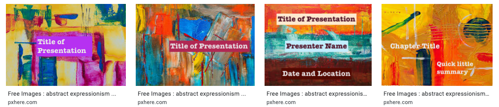

# 😂 How to Be A Fun Person

* Make use of **memes**. [9GAG ](www.9gag.com)is a great start place.
* Make exceptional use of **idioms**, etc. For example,
  * **When dining out in a restaurant**, take a sip of the water, act unimpressed and say, "taste like water."
  * If you are Greek, **upon hearing any non-English speech** \(perhaps public announcements in a plane?\), say, "it's all Greek to me."
    * Note: It also worked for me when I said "sounds like Chinese to me," so I guess you can improvise a bit.
    * Not Greek nor Chinese? Consult this [wonderful graph](https://languagelog.ldc.upenn.edu/nll/?p=1024).
* Blame your \(potentially imaginary\) cat when you mistakenly sent a garbage message to someone rubbing over your keyboard: 

  > Sorry about that message; My cat thought it funny to roll over my keyboard, and she's not even sorry.

* If you can't escape from a undesirable situation, try changing your perspective.

  > “It's all about perspective. The sinking of the Titanic was a miracle to the lobsters in the ship's kitchen. \(Oct 4, 2011\)”   ― _Wynne McLaughlin_

  * When in a contemporary art museum, if you are having a hard time making sense out of the abstract paintings, try imagining them as slide deck backgrounds.
    * Try answering these questions:
      * **What arrangement of visual objects** would this painting suitable for? A title slide? A text-and-image slide? A quotation slide?
      * What can I put each of the visual objects?
      * **Which paintings can be used together** as a template for a whole deck? A useful template for slide decks should define a style for most of the popular arrangements, such as title slide, content slide, quotation slide, and half-and-half slide. Focus on their visual coherence/consistency. 
    * Example:

