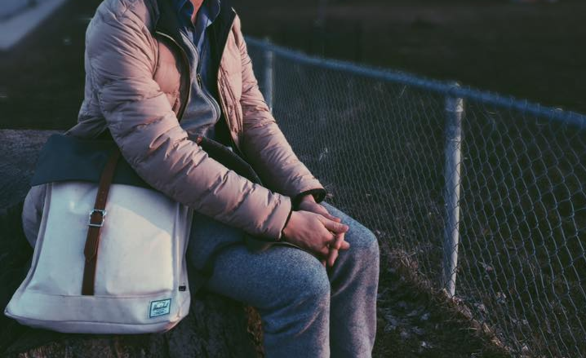
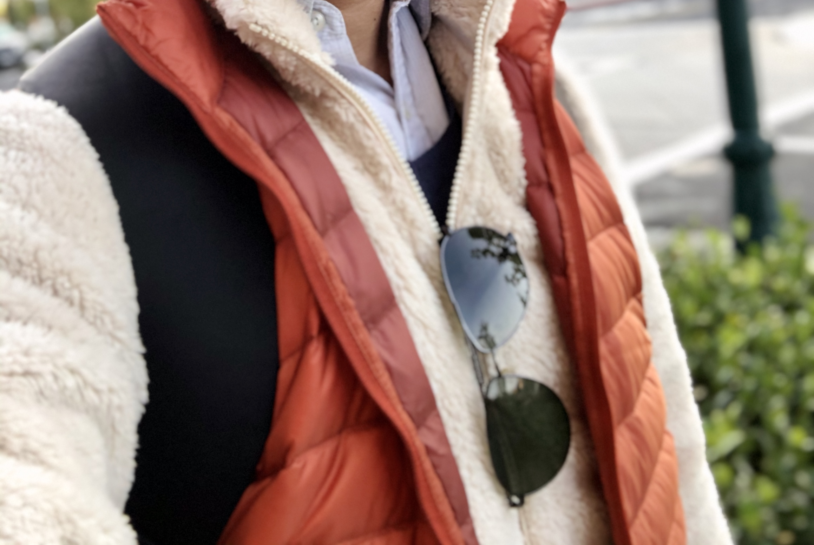

# Things I Own

## Digital Gadgets

* **MacBook \(2015\)**: Portability is king. Trust me. I can go hiking with this bad boy.
* **iPad pro \(first gen\)**: For hand-writing/drawing and occasional YouTubing. Bought this for college. Served perfectly for the cause.
* **iPhone X**: Why not.
* **Apple Watch Series 4**: Fantastic for health tracking, weather tracking, and dictating reminders.
* **Sony WH-1000XM3 Headphones**: Best noise-canceling device I could purchase early 2019.
* **Gigabyte FORCE K83 Mechanical Keyboard**: My first mechanical keyboard. Great tactile, great price \(got for $50 from Amazon\).

I'm _planning_ on the following purchases:

* **A latest Mac mini with highest configuration \($3,199.00\).** The tiny factor can be vastly appreciated when I relocate. It occurred to me that re-selling a full-factor desktop PC is not economically ideal, and I will always easily find a monitor and peripherals to plug in a Mac mini wherever I move to. 
* **Next-generation Airpods**. I loved my first gen and gave them to my dad. 

## Me and My Backpacks

In early 2016, I bought a [Herschel City Backpack](https://herschel.com/shop/backpacks/city-backpack-mid-volume?v=10486-03019-OS) while sightseeing with my mom in Toronto. It was stylish and convenient, but too small in volume to accommodate all my carryings as an undergrad.

In mid-2016, I bought a [Herschel Pop Quiz](https://herschel.com/shop/backpacks/pop-quiz-backpack) off a classmate for CAD$15. After 3 years of daily use, the backpack got extremely worn off. Sadly, I had to ditch it in September 2019.

Since then, I has been using a [Lenovo OA33911 backpack](https://www.aliexpress.com/item/32333710465.html). It works for light trips in the bay area, but seems 1\) too heavy-duty for commuting \(I don't carry any laptop to/from work\) and 2\) not as stylish to carry to social occasions. As a matter of fact, I deliberately left it at home yesterday \(10/17/2019\) so that I didn't have to carry it to a mixer.

I'm considering buying another City Backpack, but in the meantime I heard of a potential free swag in next week's new employee orientation event. Might need to hold off for that! 

## Commuting Methods

I love biking, and I love the idea of _stationless bike sharing \(SBS\)_. For example, OFO was a great option for commuting when I was doing my undergrad in Beijing. After getting spoiled by the [low cost of SBS services](https://knowledge.wharton.upenn.edu/article/why-bikecycles-are-making-a-huge-comeback-in-china/) in China, I had virtually no budget for buying bike of my own when moved to North America \(thrice\).

I bought my first and second mountain bikes from Canadian Tire in 2015 and from Walmart in 2017. As I recall, those were ~CAD$300 purchase. Now, this amount may not sound much to hobbyist bikers, but -- once again -- to someone with virtually zero budget, that was quite an investment.

The second mountain bike, also the first bike I owned while residing in Philly, was stolen during an afternoon. I biked home early that afternoon, due to an acute stomach ache. The bike was probably left unlocked in the garage by then, which left an opportunity to thefts.

A colleague of mine, J, was kindly enough to have gifted his old bike, a Giant Defy, to me. Although J repeatedly stressed that it was not technically a road bike, its lightweightness and thin tires informed me otherwise. Compared to my stolen mountain bike, it was so easy to operate that, every time I rode it, I told myself to focus on lightweightness when buying my next commuter bike in the future. Something like Giant Escape 3, perhaps?

The future came with an unexpected turn, though. My daily commute to work nowadays involves a 12 min walk, which is less than pleasant for early winter mornings, but too trivial for a bike. As a middle ground, I bought a kick scooter \(a [Razor A6](https://www.razor.com/products/kick-scooters/a6-scooter/).\) I found out that I can ride it \(as long as I stay slow and careful\) inside of Google's buildings, which made trips to microkitchens a breeze. I wonder if I would need another bike at all living in bay area. 

## Everyday Carry \(EDC\)

My **money clip** was repurposed from a [Modori Traveler's notebook pen holder](https://www.amazon.com/Midori-Travelers-notebook-holder-Brown/dp/B001D79A96). I always wrap a ID card with the bank notes. I never put my ID card together with a bank card.

For this reason, I have also a **wallet** in my backpack that holds bank cards \(credit cards, debit cards, etc.\) and extra cash. Very often I also have loyalty cards there. 

## Me and My Mattresses

The first mattress I could call my own was bought off from the previous tenant of the bedroom I leased from mid-2018 to mid-2019. The tenant, Y, happened to be an acquaintance and a schoolmate of mine. We later developed great friendship, and even started working at YouTube together.

During that year, I also received a free mattress from a visiting student, D, who was moving away. I hope all is well with D in Europe and her career.

The third mattress I own was bought off a fellow Googler, Z, for $208. By coincidence, Z got a refund for the seller, felt bad for keeping my $208, and Venmo-ed me back that amount. I ended up with another free mattress, as well as another friend. 

## Wears

I'm a loyal UNIQLO frequenter. Guess that's [why my date weren't always impressed](https://japantoday.com/category/features/lifestyle/'he-wore-uniqlo-to-meet-me!'-japanese-woman-shares-petty-bad-date-story). 

