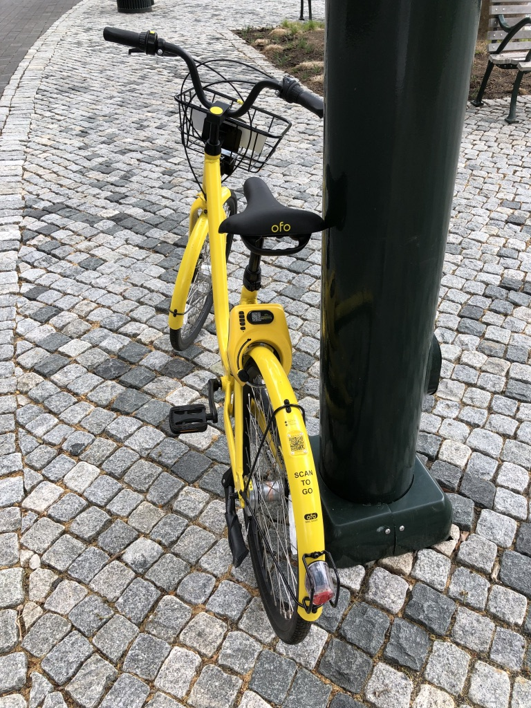
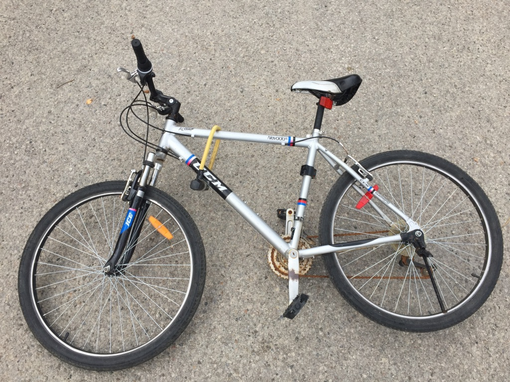
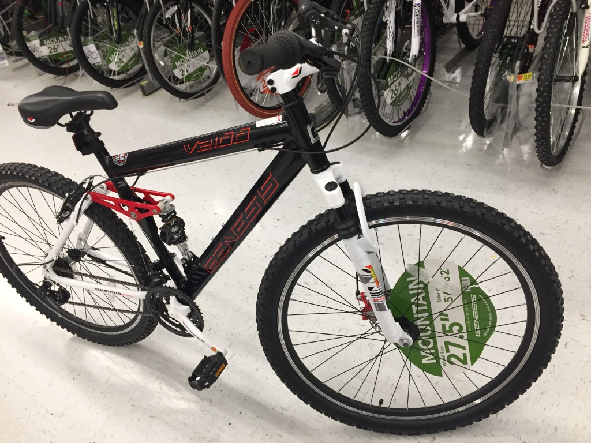
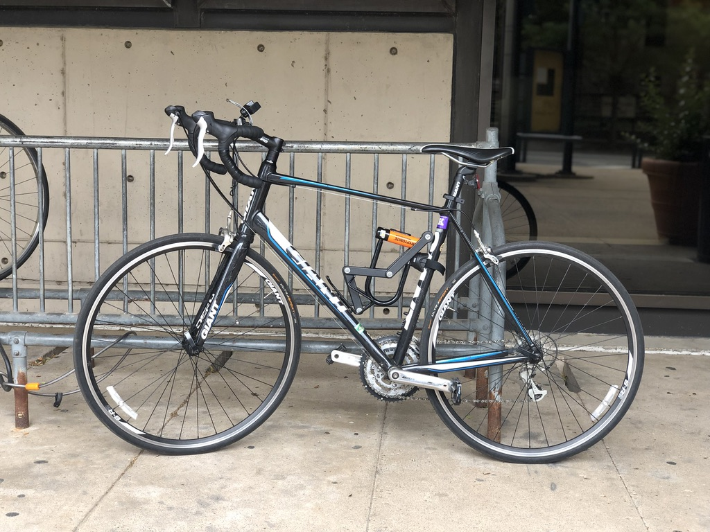

# 🚲 Bikes I Owned

I love biking, and I love the idea of _stationless bike sharing \(SBS\)_. For example, OFO was a great option for commuting when I was doing my undergrad in Beijing. After getting spoiled by the [low cost of SBS services](https://knowledge.wharton.upenn.edu/article/why-bikecycles-are-making-a-huge-comeback-in-china/) in China, I had virtually no budget for buying bike of my own when moved to North America \(thrice\).

I bought my first and second mountain bikes from Canadian Tire in 2015 and from Walmart in 2017. As I recall, those were ~CAD$300 purchase. Now, this amount may not sound much to hobbyist bikers, but -- once again -- to someone with virtually zero budget, that was quite an investment.

The second mountain bike, also the first bike I owned while residing in Philly, was stolen during an afternoon. I biked home early that afternoon, due to an acute stomach ache. The bike was probably left unlocked in the garage by then, which left an opportunity to thefts.

A colleague of mine, J, was kindly enough to have gifted his old bike, a Giant Defy, to me. Although J repeatedly stressed that it was not technically a road bike, its lightweightness and thin tires informed me otherwise. Compared to my stolen mountain bike, it was so easy to operate that, every time I rode it, I told myself to focus on lightweightness when buying my next commuter bike in the future. Something like Giant Escape 3, perhaps?

The future came with an unexpected turn, though. My daily commute to work nowadays involves a 12 min walk, which is less than pleasant for early winter mornings, but too trivial for a bike. As a middle ground, I bought a kick scooter \(a [Razor A6](https://www.razor.com/products/kick-scooters/a6-scooter/).\) I found out that I can ride it \(as long as I stay slow and careful\) inside of Google's buildings, which made trips to microkitchens a breeze. I wonder if I would need another bike at all living in bay area. 

