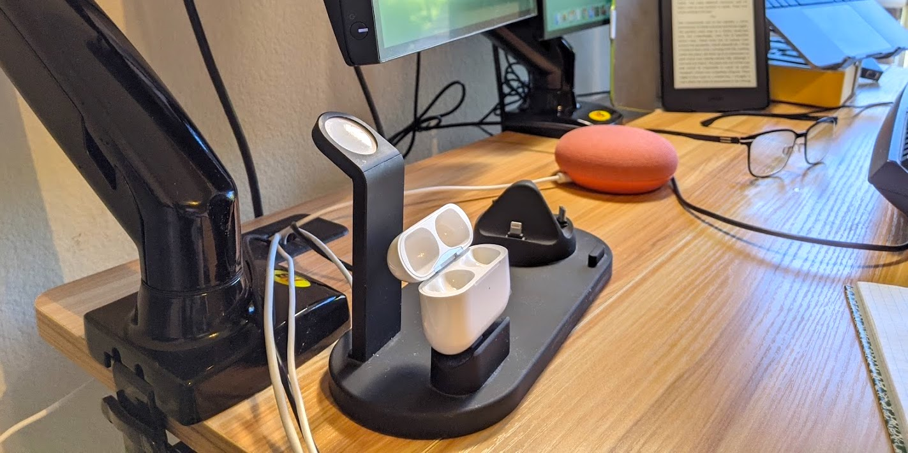

# 🎧 Ear-/headphones I Owned

## My first pair of earbuds: Sennheiser MX500 Blue

I received my first pair of earphones in my sixth grade. Being too young at that time, I was neither able to tell the brand/model of those earphones, nor felt the need to take down any visual clue that I could research with after a few years. Many years later, when I was browsing aimlessly online, I bumped into an image of Sennheiser MX500 Blue, and I immediately recognized that those were the pair of earbuds I listened to everyday when I was much younger. 

Oddity is that, those earphones I owned were simply a gift that came with the purchase of a Chinese-branded electronic dictionary. It does not make sense to have a Sennheiser accompanying. Therefore, I suspect that those are fake ones. However, this does not explain why those earbuds sounded so good -- I could still remember the first night I listened with them: The song was _Close to You_ by Susan Wong, and I wondered in the corridor outside my condo, subconsciously, in search of a quieter corner so that I could take in all the details in the music. The sound quality was _that_ good, compared to bookshelf speakers I used to listen to. I would rather believe that I had an authentic pair of Sennheiser MX500.

## Sony Clip-on Stereo Headphones with Retractable Wires: MDR-Q38LW 

In my freshman year, a roommate lent me his MDR-Q38LW after my old daily drivers died. He didn't want them anymore, for he had purchased new models, so I got to keep using them till they too died in my hands. By that time, I was so deeply in love with those earphones that I purchased another pair from Hong Kong -- Yes; they were no longer in production by then.

They had excellent sound qualities as you would expect from Sony and a tethered device, and they were not at all prone to tangling, because the wires were retractable with one click. That little touch of mechanical mechanism in an electronic device brought so much fun in the age of 2014.

## Beats Studio 2

I picked them up beside a recycle bin. The ear pads were badly torn, so I bought a pair of new ones off Amazon for $10. The new ear pads were, of course, aftermarket, and they were affixed to the headphones via double-sided adhesive tapes, rather than folding and anchoring into the plastic caps themselves. After some careful sanitizing \(it was beside garbages, anyways\), the headphones were back to usable state.

They were my first pair of active noise-cancelling \(ANC\) headphones. I was expecting to be astonished by the silence it could have brought, but the ANC was so bad that I was in fact disappointed. I suspect that the adhesive tapes introduced air gaps that compromised the headphones' airtightness, on which ANC relied on.

Curious what the newest technology could offer, I bought a pair of Sony WH-1000XM3 headphones in early 2019. 

## Sony WH-1000XM3

The WH-1000X M3 headphones offered state-of-the-art ANC and premium audio quality like Sony audio devices always do.

That's not to say there weren't quirks I wish could have been improved, though. For one, the first batches of products suffered from malfunctioning touch pads: When the weather gets cold and a wind blows over the right ear cup, the headphones might mistake them as user inputs. I personally experienced this problem and had to have them replaced. That's why I ended up with two identical headphone cases, if you've seen my inventories.

After sleeping in the back seats while my father drove my family through Tibetan trails during summer 2019, I broke the connecting pieces at the ends of the hairband. Although I fixed them with duct tapes, strands of my hair always get stuck into those tiny slits when I take the headphones off. It was so irritating that I have not used them ever again after I got my AirPods Pro.

## Apple AirPods

In late 2017, I was unsure about where I can spent my first-ever paychecks in my life \(while completely ignoring the fact that my parents were still paying my rent and tuitions\), and AirPods then became one of my best impulse purchases.

Some would say they are easy to lose, while I would contend that they are easy to take off. This is particularly helpful in situations like bumping into your professor on a sidewalk: You would \(probably\) want to greet them, and preferably with at least one earbud removed to exhibit politeness. AirPods are something that can serve you well in such cases.

Even bumping into someone who you deemed unnecessary for such attentiveness, AirPods are also audio-transparent enough for quick how-are-you-doings. On the other hand, this also implies that AirPods are not the ones you want to take a flight with -- you won't be able to hear a thing.

I had these for 1.5 years and gave them to my father, who enjoyed them a lot.

## Apple AirPods Pro

Recommended if you don't yet have earbuds or active noise cancellation earphones; Not recommended if you own either \(or both\) of those.

As a former Airpods 1st gen user, I would say Airpods Pro are less elegant products. This is because, when you take them off too fast from your ear and accidentally rub its rubber part against your antihelix, the rubber dome is prone to getting folded up. A pair of foam-based dome may help mitigating this problem.

